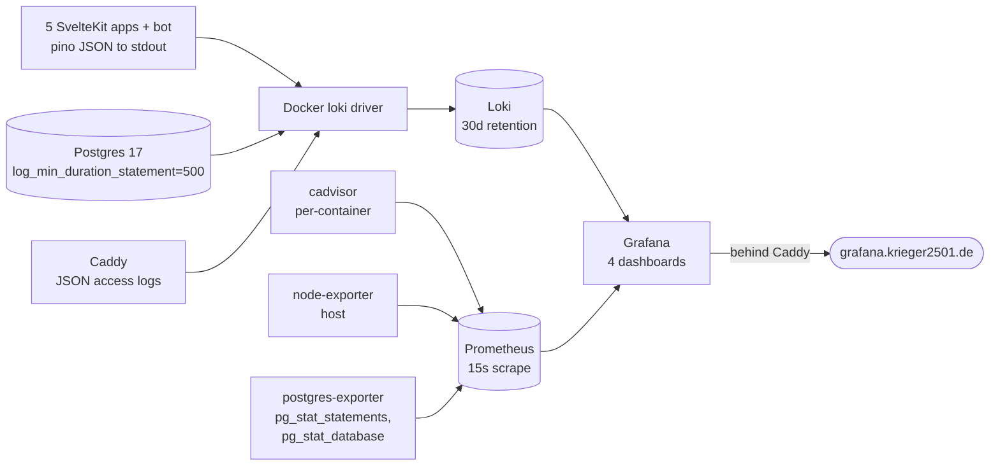

# Observability

## Overview

Nexo runs a self-hosted observability stack on the VPS: structured JSON logs into **Loki**, container/host/Postgres metrics into **Prometheus**, both queried via **Grafana**. Four pre-provisioned dashboards. Correlation IDs propagate through every request log line for cross-service tracing.

The admin app exposes a built-in log viewer for the common case of "tail this one container's logs without leaving the suite".



---

## Stack at a glance

| Component         | Role                                       | Image                              | Local access                                         | Production access                |
| ----------------- | ------------------------------------------ | ---------------------------------- | ---------------------------------------------------- | -------------------------------- |
| `@nexo/logger`    | Structured JSON logger (pino) used by apps | n/a (workspace package)            | n/a                                                  | n/a                              |
| Loki              | Log aggregation, 30d retention             | `grafana/loki:3.4.2`               | `localhost:3100`                                     | internal only                    |
| Prometheus        | Metrics aggregation, 15s scrape interval   | `prom/prometheus:v2.55.1`          | inside compose network                               | internal only                    |
| cadvisor          | Per-container CPU / memory / network / IO  | `gcr.io/cadvisor/cadvisor:v0.49.1` | inside compose network                               | internal only                    |
| node-exporter     | Host CPU, RAM, disk, swap, sockets         | `prom/node-exporter:v1.8.2`        | inside compose network                               | internal only                    |
| postgres-exporter | `pg_stat_database`, `pg_stat_statements`   | `…/postgres-exporter:v0.16.0`      | inside compose network                               | internal only                    |
| Grafana           | Log + metric querying, dashboards          | `grafana/grafana:11.5.0`           | `localhost:3005` (via `docker-compose.override.yml`) | `https://grafana.krieger2501.de` |
| Admin app         | In-suite log tail + healthz surface        | `ghcr.io/nexo-suite/nexo-admin:…`  | `localhost:3004/services`                            | `admin.krieger2501.de/services`  |

Default Grafana login: `admin` / value of `GRAFANA_PASSWORD` from `.env`.

---

## Structured logging with `@nexo/logger`

Each app imports the shared logger:

```typescript
import { createLogger } from '@nexo/logger';

const logger = createLogger('finance');
logger.info('expense created', { userId, amount, correlationId });
```

Every log line is JSON with standard fields:

- `level` — log level (info, warn, error)
- `time` — ISO timestamp
- `service` — which app emitted it (matches the createLogger argument)
- `correlationId` — request trace ID (propagated via `x-correlation-id` header)
- `msg` — human-readable message
- Plus any structured fields passed in the second argument

---

## Correlation IDs

Each incoming HTTP request gets a correlation ID:

1. If the request has an `x-correlation-id` header, use it (propagation from upstream).
2. Otherwise, generate a new UUID.

The correlation ID is:

- Attached to all log lines for that request (set in `hooks.server.ts` and stored on `locals.correlationId`).
- Returned to the client in error responses so users can copy it from a toast and report it.
- Surfaced in the admin app's Diagnostics card and the landing app's `/apps` Diagnostics card.

---

## Metrics — Prometheus + 3 exporters

Config: `prometheus/prometheus.yml` (scrape config) and `prometheus/postgres-queries.yaml` (custom postgres-exporter queries — top queries by mean exec time, lock waits, slow queries).

| Exporter            | What it scrapes                                                                                                                       |
| ------------------- | ------------------------------------------------------------------------------------------------------------------------------------- |
| `cadvisor`          | Per-container CPU%, memory vs. limit, network bytes, block I/O                                                                        |
| `node-exporter`     | Host CPU, load avg, RAM, disk usage, swap, open sockets                                                                               |
| `postgres-exporter` | `pg_stat_database` (commits, rollbacks, blocks), `pg_stat_statements` (top queries by mean exec time), `pg_database_size`, lock waits |

> `pg_stat_statements` is loaded via `shared_preload_libraries` in postgres's `command:` args, but the extension object itself has to be created per-database with `CREATE EXTENSION pg_stat_statements;`. See [Deployment — PgBouncer migration](deployment.md#migrating-an-existing-prod-to-pgbouncer-one-time) for the one-time setup.

---

## Logs — Loki + Docker driver

In `docker-compose.yml`, every app service uses the Loki log driver:

```yaml
auth:
  logging:
    driver: loki
    options:
      loki-url: 'http://localhost:3100/loki/api/v1/push'
      mode: non-blocking
      max-buffer-size: 4m
      loki-external-labels: 'service=auth,container_name={{.Name}}'
```

This ships container stdout straight to Loki with stable `service` and `container_name` labels for filtering.

Postgres is configured with `log_min_duration_statement=500` so slow queries land in the same stream and show up in the Logs Explorer dashboard alongside app logs.

Loki config: `loki/config.yaml`. Default retention 30d. Storage on local filesystem (`loki_data` named volume). Ingester capped at `ingestion_rate_mb=4` and `max_streams_per_user=1000` so a runaway log loop can't fill the disk.

---

## Grafana dashboards

Provisioned from `grafana/provisioning/dashboards/json/` so they version with the repo and survive a Grafana restart. Datasources (Loki + Prometheus) are provisioned from `grafana/provisioning/datasources/`.

| Dashboard              | File                                                       | Use case                                                                                                           |
| ---------------------- | ---------------------------------------------------------- | ------------------------------------------------------------------------------------------------------------------ |
| **Stack Overview**     | `grafana/provisioning/dashboards/json/stack-overview.json` | Container count, host RAM/disk/swap, PG connections, log/error rates by service                                    |
| **Per-App Deep Dive**  | `grafana/provisioning/dashboards/json/app-deep-dive.json`  | `$app` template var → memory vs limit, CPU%, Caddy request rate by status class, p50/p95/p99 latency, error counts |
| **Postgres Internals** | `grafana/provisioning/dashboards/json/postgres.json`       | Cache hit ratio, connections, DB size, commits/sec, tuple rates, top queries by mean exec time, slow query log     |
| **Logs Explorer**      | `grafana/provisioning/dashboards/json/logs-explorer.json`  | `service` × `level` × free-text contains; total/error stats, log rate, raw log panel                               |

---

## Admin app log viewer

The admin app's Services panel (`/services/[name]`) is the in-suite path for "tail this container":

- Queries Loki directly for the selected container's logs.
- Real-time streaming (tail mode).
- Dynamic field selector to show/hide JSON fields.
- Highlights errors and warnings; expandable rows show full JSON detail.
- Healthz panel charts the latest probe latency + uptime ribbon from `admin.health_check_run`.

For deeper queries (cross-service correlation IDs, free-text across many services, longer time ranges), use Grafana's Logs Explorer dashboard.

---

## Local development

`pnpm docker:observe` brings up Loki + Grafana locally (the override compose file maps Grafana to host port 3005 and Loki to 3100):

```bash
pnpm docker:observe         # start loki + grafana
pnpm docker:observe:down    # stop them
```

Apps in dev mode (`pnpm dev`) emit pretty-printed pino logs to stdout. To get them into local Loki, run them via Docker (`docker compose up`), not `pnpm dev` — pino-to-Loki is wired through the Docker log driver, not through the apps directly.

---

## Querying

### Grafana (LogQL)

```logql
{service="finance"} | json | level="error"
{service="auth"} | json | correlationId="abc-123"
{service=~"finance|auth"} | json | line_format "{{.msg}}"
```

### Grafana (PromQL)

```promql
# Per-container memory as % of limit
container_memory_usage_bytes{name=~"nexo-.+"} / container_spec_memory_limit_bytes{name=~"nexo-.+"}

# Top 10 slowest Postgres queries by mean exec time
topk(10, pg_stat_statements_mean_time_seconds)

# Caddy 5xx rate by host
rate(caddy_http_requests_total{code=~"5.."}[5m])
```

### Admin app

`admin.krieger2501.de/services` → pick a container → Logs tab. Use the field picker to customize which JSON fields are displayed.
